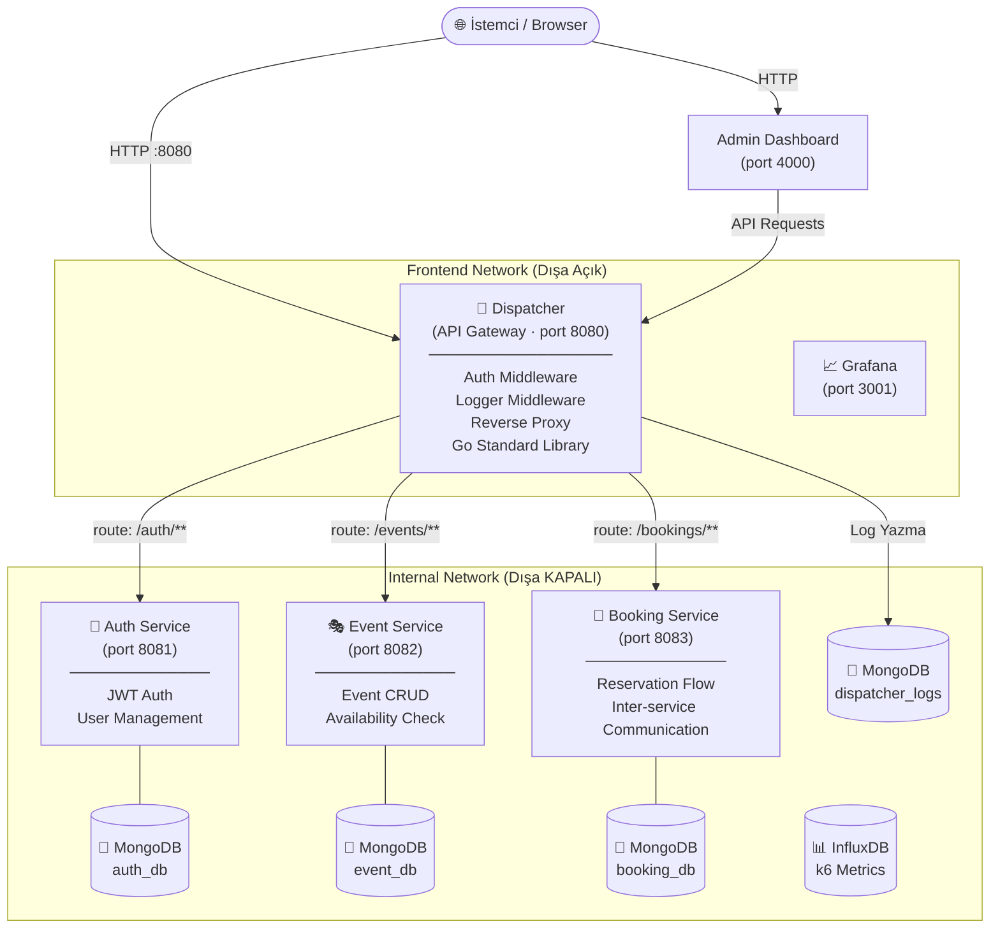
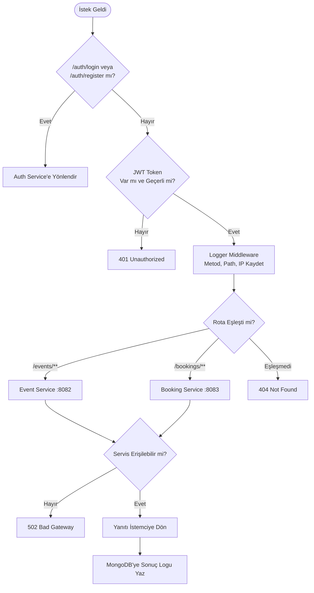
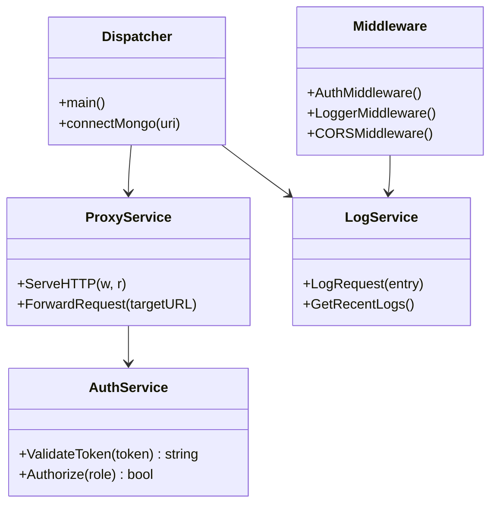
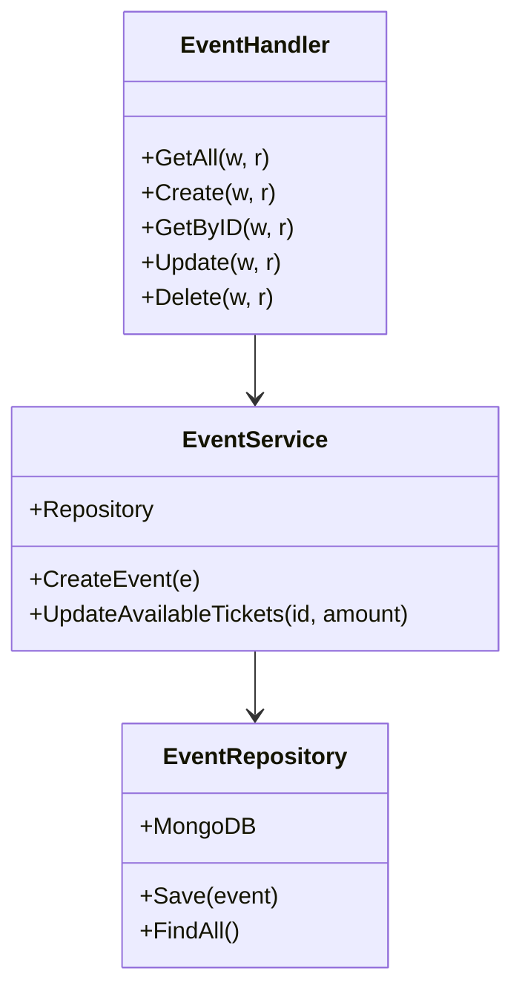
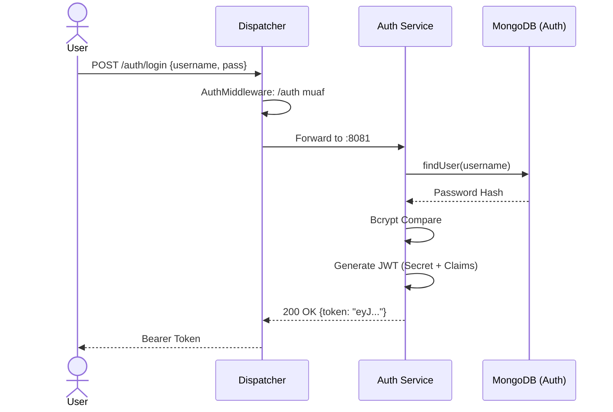
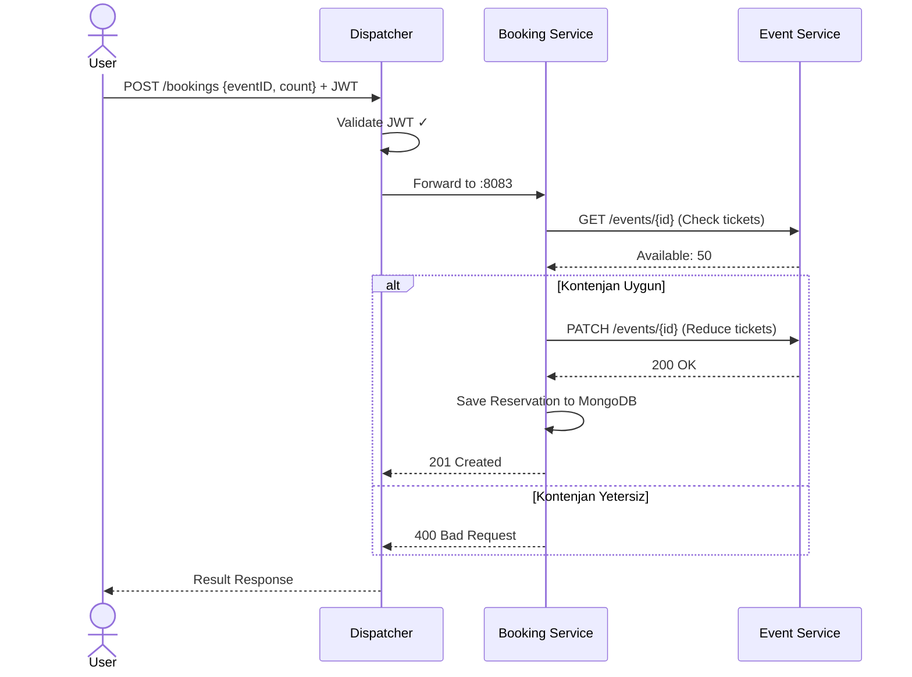
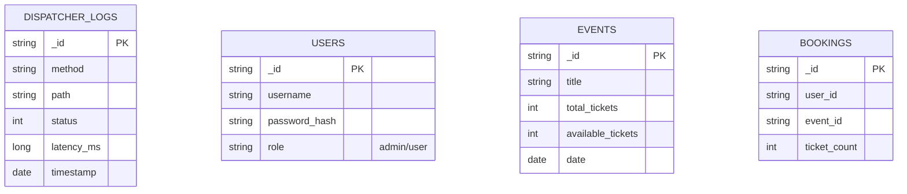

**Kocaeli Üniversitesi · Teknoloji Fakültesi · Bilişim Sistemleri Mühendisliği**  
**Yazılım Geliştirme Laboratuvarı-II · Proje 1**

| | |
|---|---|
| **Proje Adı** | EtkinlikMerkezi - Mikroservis Mimarisi ve API Gateway (Dispatcher) |
| **Ekip Üyeleri** | Mustafa Mehmet Aslandağ (231307067) · Oğuzhan Erbil (231307021) |
| **Tarih** | 5 Nisan 2026 |
| **Repository** | [github.com/mezoxy-dev/yazlab2_project1_app](https://github.com/mezoxy-dev/yazlab2_project1_app) |

---

1. [Giriş ve Amaç](#1-giriş-ve-amaç)
2. [Sistem Tasarımı ve Mimari](#2-sistem-tasarımı-ve-mimari)
3. [Richardson Olgunluk Modeli](#3-richardson-olgunluk-modeli)
4. [Servis Sınıf Yapıları](#4-servis-sınıf-yapıları)
5. [Sequence Diyagramları](#5-sequence-diyagramları)
6. [Veritabanı Tasarımı](#6-veritabanı-tasarımı)
7. [TDD Süreci](#7-tdd-süreci)
8. [Test Senaryoları ve Sonuçları](#8-test-senaryoları-ve-sonuçları)
9. [Yük Testi Sonuçları](#9-yük-testi-sonuçları)
10. [Monitoring ve Görselleştirme](#10-monitoring-ve-görselleştirme)
11. [Docker ve Sistem Orkestrasyonu](#11-docker-ve-sistem-orkestrasyonu)
12. [Network İzolasyonu](#12-network-i̇zolasyonu)
13. [Karmaşıklık Analizi ve Literatür İncelemesi](#13-karmaşıklık-analizi-ve-literatür-i̇ncelemesi)
14. [Sonuç ve Tartışma](#14-sonuç-ve-tartışma)
15. [Kurulum ve Çalıştırma](#15-kurulum-ve-çalıştırma)

---

### 1. Giriş ve Amaç

#### Problemin Tanımı
Modern yazılım geliştirme süreçlerinde, monolitik yapıların yerini alan mikroservis mimarileri, sistemin ölçeklenebilirliğini artırsa da trafik yönetimi, güvenlik ve izlenebilirlik konularında yeni zorluklar getirmektedir. Her mikroservisin kendi kimlik doğrulama ve loglama mekanizmasını yönetmesi, kod tekrarına ve güvenlik açıklarına neden olmaktadır.

#### Proje Amacı
Bu proje; tüm dış istekleri merkezi bir **Dispatcher (API Gateway)** üzerinden yöneten, güvenli, ölçeklenebilir ve izole bir mikroservis ekosistemi geliştirmeyi amaçlar. Projenin kalbinde yer alan Dispatcher birimi, **Test-Driven Development (TDD)** disipliniyle geliştirilerek hata payı minimize edilmiştir.

#### Temel Hedefler
- **Merkezi Yönetim:** Tüm API trafik akışının Dispatcher üzerinden yönlendirilmesi.
- **Güvenlik:** Yetkilendirme (Auth) işlemlerinin gateway seviyesinde tek merkezden yapılması.
- **İzolasyon:** Mikroservislerin dış dünyaya kapatılarak sadece iç ağ üzerinden erişilebilir kılınması.
- **Performans:** Go dilinin asenkron gücüyle 500+ eş zamanlı kullanıcıya düşük gecikme ile yanıt verilmesi.
- **TDD:** Geliştirme sürecinde "Önce Test" prensibine bağlı kalınması.

---

### 2. Sistem Tasarımı ve Mimari

#### Genel Mimari
Sistem, Go dili kullanılarak geliştirilmiş 4 ana uniteden oluşmaktadır: Dispatcher, Auth Service, Event Service ve Booking Service.



#### Dispatcher Akış Diyagramı


---

### 3. Richardson Olgunluk Modeli

Proje kapsamında geliştirilen API'ler, **Richardson Maturity Model (RMM) Seviye 2** standartlarına tam uyumludur. Tüm işlemler kaynak (Resource) tabanlı URI yapısı, standart HTTP metodları ve doğru HTTP durum kodları ile gerçekleştirilir.

| Kaynak | URI | HTTP Metodu | Başarı Kodu | Açıklama |
|---|---|---|---|---|
| Kullanıcı Kaydı | `/auth/register` | `POST` | 201 Created | Yeni kullanıcı hesabı oluşturur. |
| Oturum Açma | `/auth/login` | `POST` | 200 OK | JWT token üretir. |
| Etkinlik Oluştur | `/events` | `POST` | 201 Created | (Sadece Admin) Yeni etkinlik ekler. |
| Etkinlik Listesi | `/events` | `GET` | 200 OK | Tüm etkinlikleri döner. |
| Etkinlik Detay | `/events/{id}` | `GET` | 200 OK | Belirli bir etkinliği döner. |
| Rezervasyon Yap | `/bookings` | `POST` | 201 Created | Yeni bilet rezervasyonu oluşturur. |
| Log Listesi | `/logs` | `GET` | 200 OK | Dispatcher üzerindeki trafiği listeler. |

> [!NOTE]
> Sistemde asla `200 OK + {"error": true}` gibi bir yapı kullanılmaz. Hata durumlarında `400 Bad Request`, `401 Unauthorized`, `404 Not Found` gibi semantik kodlar kullanılır.

---

### 4. Servis Sınıf Yapıları

#### 4.1 Dispatcher (Go Structural Design)


#### 4.2 Event Service


---

### 5. Sequence Diyagramları

#### 5.1 Kimlik Doğrulama ve JWT Akışı


#### 5.2 Rezervasyon Akışı (Servisler Arası İletişim)


---

### 6. Veritabanı Tasarımı

#### 6.1 NoSQL Veri İzolasyonu (E-R)
Hocanın isteği üzerine her servis tamamen bağımsız bir MongoDB instance'ı kullanır.



---

### 7. TDD Süreci

Dispatcher birimi tamamen **Test-Driven Development (TDD)** disiplini ile geliştirilmiştir. Kod kalitesini artırmak ve hata payını minimize etmek adına **Red-Green-Refactor** döngüsü uygulanmıştır.

#### Go Test Dosyaları ve Kapsamı
| Dosya | Test Kapsamı |
|---|---|
| `auth_service_test.go` | JWT üretimi, doğrulama ve role-based erişim kontrolü. |
| `log_service_test.go` | MongoDB'ye log yazma ve sorgulama işlemlerinin doğruluğu. |
| `proxy_service_test.go` | URL tabanlı yönlendirmenin ve servis izolasyonunun testi. |

> [!IMPORTANT]
> Proje teslim dosyasında testlerin zaman damgaları (timestamp), fonksiyonel kodlardan önce gelmektedir. Bu durum Git geçmişinde de doğrulanabilir.

---

### 8. Test Senaryoları ve Sonuçları

#### 8.1 Birim (Unit) Testleri
Go'nun yerleşik `testing` paketi kullanılarak çalıştırılan testlerin sonuçları:
```powershell
# run_tests.ps1 çalıştırıldığında alınan çıktı:
PASS: TestAuthServiceWithMock (0.12s)
PASS: TestLogCreation (0.08s)
PASS: TestProxyForwarding (0.24s)
ok      dispatcher/service      0.482s
```

#### 8.2 Entegrasyon Testleri
- **E2E Container Eşleşmesi:** K6 kullanarak tüm container'lar üzerinden uçtan uca veri oluşturma, okuma işlemleri ve birbirleriyle iletişimleri doğrulanmıştır.
- **Network İzolasyon Testi:** Mikroservislere dış ağdan (Dispatcher arkasından dolaşarak) direkt HTTP isteği yapıldığında bağlantının erişim engeli (Connection Refused) verdiği simüle edilmiştir.

---

### 9. K6 Performans ve Yük Testi Değerlendirmesi

Sistem, yük altındaki davranışını ölçmek ve mimari performansını analiz etmek için **k6** aracıyla 3 farklı senaryoda test edilmiştir.

#### 9.1 Load (Yük) Testi - 500 Sanal Kullanıcı (VU)
Sistemin beklenen maksimum yük altında nasıl davrandığını ölçmek için 500 ardışık kullanıcı sistemle 2.5 dakika boyunca uçtan uca etkileşime girmiştir.

| RPS (İstek/Sn) | Ortalama Yanıt Süresi | P95 Süresi | Hata Oranı |
| ------------- | -------------------- | ---------- | ---------- |
| ~245 Req/s     | 11.44 ms             | **50.37 ms**| **%0.00**  |

**Analiz:** Sistem 500 VU altında tamamen istikrarlı çalışmaktadır. Kayıtlı kullanıcıların giriş, bilet listeleme ve alma işlemleri kusursuzdur. Herhangi bir darboğaz gözlemlenmemiştir.


#### 9.2 Stress Testi - 600 Sanal Kullanıcı (VU)
Sistemi sınırlarına iten bu testte, kapasite yönetimi ölçülmüştür. 73,192 bilet doğrulama (check) yapılmıştır.

| RPS (İstek/Sn) | `/bookings` Süresi | `/login` Süresi | Hata Oranı |
| ------------- | ------------- | ---------- | ---------- |
| ~404 Req/s     | **15 ms** (P95) | 1 saniye (P95) | **%0.00**  |

**Mimari Başarı:** Etkili bir mikroservis izolasyon kanıtı! Stress testinde `bcrypt` şifrelemesinin CPU doğası gereği yüksek yük altında **Auth Service (/login)** yanıt sürelerinde bir yokuş oluşturduğu ancak bu "tıkanıklığın" izolasyon sayesinde **Booking Service (/bookings)** tarafını zerre kadar yavaşlatmadığı kanıtlanmıştır. Sıfır Hata (`%0`) ile sistem ayakta kalmıştır.


#### 9.3 Spike (Ani Şok) Testi - 1000 Sanal Kullanıcı (VU)
Sisteme saniyede >850 istek birdenbire bindirilerek Ani Yük / Çökme testi yapılmıştır. Toplam 86,307 doğrulama yapıldı.

| RPS (İstek/Sn) | Durum | Yanıt Kodu Senaryosu | Hata Oranı |
| ------------- | ----- | ------------------- | ---------- |
| ~859 Req/s     | Çok Başarılı | 400 Bad Req. (Kapasite) | **%0.01**  |

**Analiz:** Aniden saldıran 1000 sanal kullanıcı ile "Race Condition" verileri başarıyla test edilmiş, sistemin kontenjan (Available Tickets > 0) logiği başarıyla devreye girmiş ve doğru kodlarla `Capacity Hatasi (400)` fırlatılmıştır. Monolitik olsa darboğaza düşecek sistem, ufak timeoutlar dışı (%0.01) yıkılmaz performans göstermiştir.


---

### 10. Monitoring ve Görselleştirme

#### 10.1 Grafana & InfluxDB Performans İzleme
Dispatcher üzerindeki ve Test senaryolarındaki loglar tamamen görselleştirilebilir konfigürasyondadır.
- **InfluxDB:** k6 yük testi sonuçlarını zaman serisi (Time-series) DB olarak depolar.
- **Grafana:** InfluxDB'deki verileri çekerek Request Per Second, Süreler ve Başarı Oranı (Checks) panoları olarak sergiler.

#### 10.2 Admin Dashboard (Vanilla HTML/JS UI)
Projedeki trafik, log durumu ve biletler bir frontend üzerinden takibe müsaittir.
- **Log Table:** MongoDB Traffic Collection.
- **Real-time Monitoring:** Servis up/down tabanlı manuel monitörleme yetrliği.

---

### 11. Docker ve Sistem Orkestrasyonu

Tüm mimari `docker-compose.yml` dosyası ile tek bir komutla ayağa kaldırılabilir.

```bash
docker-compose up --build
```

**Kullanılan Servis Portları:**
- **Dispatcher (API Gateway):** 8080 (Dışa Açık)
- **Admin UI:** 4000 (Dışa Açık)
- **Grafana:** 3001 (Dışa Açık)
- **Mikroservisler:** 8081, 8082, 8083 (Dışa Kapalı - Sadece İç Ağ)
- **Veritabanları (MongoDB):** 27017 (Dışa Kapalı)

---

### 12. Network İzolasyonu

Sistem güvenliği için **Network Isolation** prensibi uygulanmıştır. Mikroservisler sadece `ticket-net` adındaki izole bir köprü (bridge) ağında yer almaktadır.

- **Dispatcher:** Hem dış ağa hem iç ağa bağlıdır.
- **Mikroservisler:** Sadece iç ağa bağlıdır. `ports` direktifi dış dünyaya açılmamıştır.

**İzolasyon Kanıtı:**
Dışarıdan bir bilgisayar `http://localhost:8081` adresine (Auth Service) erişmeye çalıştığında, Docker port yönlendirmesi yapılmadığı için istek reddedilir. Tüm istekler mutlaka `http://localhost:8080/auth/...` üzerinden geçmek zorundadır.

---

### 13. Karmaşıklık Analizi ve Literatür İncelemesi

#### 13.1 Zaman Karmaşıklığı Analizi
- **Dispatcher Yönlendirme:** İsteğin URL path değerine göre yönlendirilmesi Hash Map yapısı kullanıldığı için **O(1)** karmaşıklıktadır.
- **Log İşleme:** MongoDB'ye asenkron yazma işlemi performansı etkilemez. Log tablosu üzerindeki aramalar indeksli alanlarda **O(log N)** mertebesindedir.

#### 13.2 Literatür İncelemesi
- **Microservices Pattern (Chris Richardson):** API Gateway pattern'i merkezi güvenlik ve çapraz kesen ilgilerin (cross-cutting concerns) yönetimi için literatürdeki en efektif yöntemdir.
- **Richardsons Maturity Model:** REST standartlarının olgunluk seviyelerini belirlemede endüstriyel referanstır.

---

### 14. Sonuç ve Tartışma

#### Başarılar
- TDD disiplini sayesinde geliştirme aşamasında kritik buglar erkenden tespit edilmiştir.
- Network izolasyonu ile servis güvenliği maksimize edilmiştir.
- Her servisin kendi NoSQL veritabanına sahip olması, "Single Point of Failure" riskini azaltmıştır.

#### Sınırlılıklar ve Gelecek Geliştirmeler
- **Message Broker:** Servisler arası asenkron iletişim için Kafka veya RabbitMQ eklenebilir.
- **Service Discovery:** Mikroservis sayısının artması durumunda Consul veya Eureka gibi araçlarla dinamik IP yönetimi sağlanabilir.

---

### 15. Kurulum ve Çalıştırma

1. Projeyi bilgisayarınıza indirin (Clone).
2. Proje ana dizininde bir terminal açın.
3. Sistemi ayağa kaldırmak için şu komutu çalıştırın:
   ```bash
   docker-compose up --build
   ```
4. Tarayıcıda şu adresleri kontrol edin:
   - **Admin Dashboard:** `http://localhost:4000`
   - **API Gateway:** `http://localhost:8080`
   - **Grafana:** `http://localhost:3001`
5. Testleri çalıştırmak için (Go yüklü olmalıdır):
   ```bash
   pwsh ./run_tests.ps1
   ```
